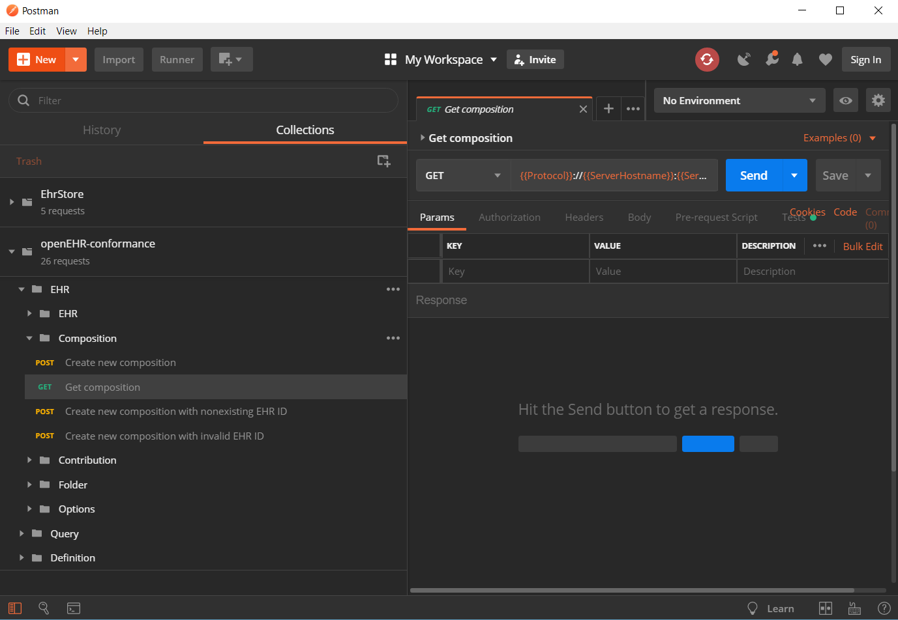

# EhrStore API TESTS
[Postman](https://www.getpostman.com/) tests for the [DIPS](https://www.dips.no)
EHR Store openEHR server implementation. In addition to our proprietary API, we 
include tests for the 
[open EHR REST API](https://github.com/openEHR/specifications-ITS-REST). Users
can either run the tests through a command-line interface, or through Postman.



# Run Tests 
## Powershell 

Use the [run.ps1](run.ps1) script to run the tests: 

```
$ ./run.ps1 -Url "http://localhost:9000"
```

Note that you'll need to install 
[Node.js and npm](https://www.npmjs.com/get-npm) prior to running these tests.

## Postman
[Import](https://learning.getpostman.com/docs/postman/collection_runs/working_with_data_files/#importing-sample-collection-files)
and
[run](https://learning.getpostman.com/docs/postman/collection_runs/starting_a_collection_run/)
the collections from the [src/](src/) directory. 
